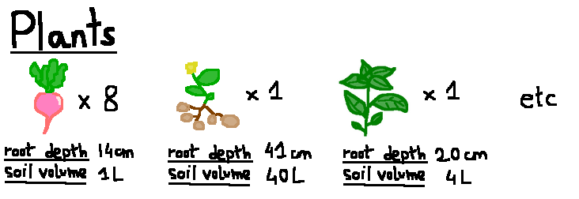
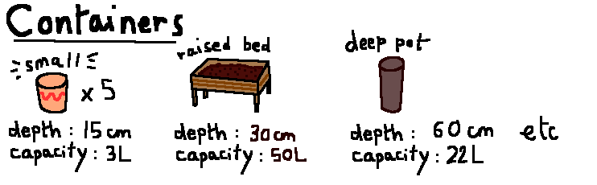

# Planting-optimization-with-Linear-Programming

Small project to learn how to design and solve Linear Programming models using PuLP. 

Optimize how to plant seeds in containers since it's Spring !

## Introduction

Every plant has its own characteristics. Some plants need very deep containers to leave enough space for roots to grow (e.g. potato) or need enough free soil and nutrients (e.g. zucchini) while others can grow with very limited space & ressources (e.g. radish).

Given a set of seeds we would like to plant :



We would like to decide which containers to use :



The goal is to efficiently plan how to plant our seeds in the available containers by minimizing number of containers used and volume of soil to prepare/buy while also making sure that the allocated containers are suitable for each plant.

## Environment
```
conda env create -f environment.yml
```

## Run
```
python3 main.py
```

## Ideas list
- [ ] Add more constraints (sun exposure, soil type)
- [ ] Add scheduling of when to sow (e.g. radish = March, garlic = winter)
- [ ] Add scheduling of when to add fertilizer considering that soil nutrients are depleting at different rate depending on which plant is planted and growth stage. (e.g. bush bean produces its own nitrogen and therefore doesn't need nitrogen from fertilizer) (e.g. Adding too much nitrogen fertilizer can cause radish to only grow leaves instead of bulb)
- [ ] Add time needed to grow (e.g. radish = 30 days) and "happiness"/"profit" associated with each plant (I save more money and feel happier if I manage to grow single zucchini plant than 4 radishes.) 


